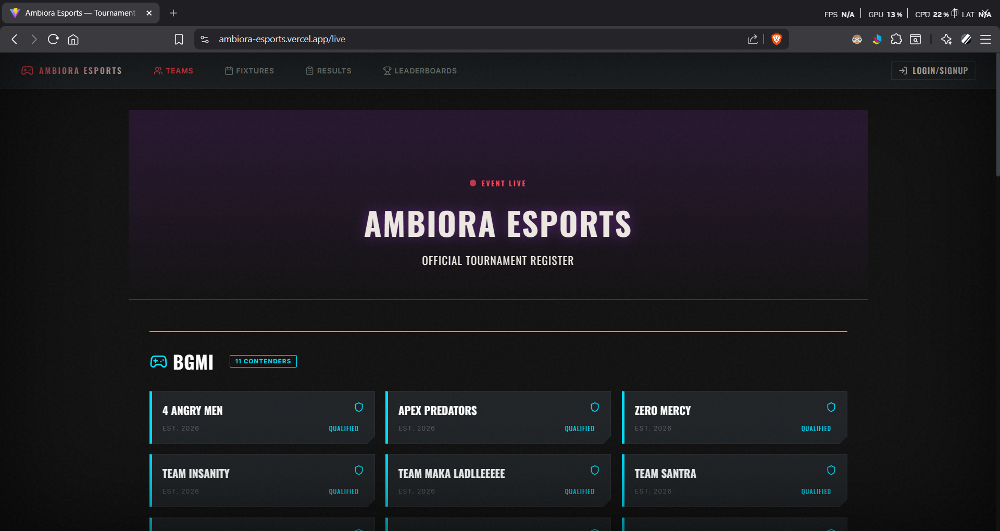
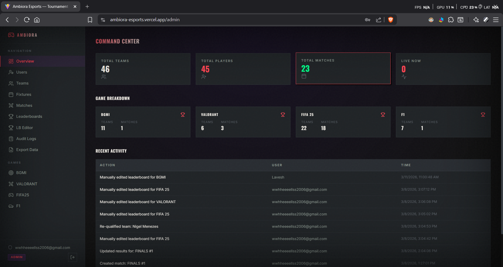

# 🎮 Ambiora Esports

<p align="center">
  <b>Full-stack esports tournament management platform</b><br/>
  Built to handle competitions at scale — from registrations to real-time results and leaderboards.
</p>

<p align="center">
  🚀 Deployed for a live college tech event <b>(AMBIORA)</b>
</p>

---

## 📸 Product Preview

### 🚀 Landing Page
<p align="center">
  
</p>

<p align="center">
  <b>Seamless onboarding for players and teams</b><br/>
  Instantly communicates tournaments, registrations, and live events through a clean, responsive interface designed for clarity and speed.
</p>

---

### 🛠️ Admin Dashboard
<p align="center">
  
</p>

<p align="center">
  <b>Centralized control for tournament operations</b><br/>
  Manage teams, fixtures, results, and leaderboards in real-time with structured workflows and zero manual overhead.
</p>

---

## 🚀 Overview

Managing esports tournaments manually (paper/Excel) leads to:
- Duplicate entries  
- Unfair team compositions  
- Inconsistent match data  
- No real-time visibility  

**Ambiora Esports** eliminates these issues with a centralized system that enforces constraints, ensures consistency, and automates tournament workflows.

---

## ⚙️ Features

### 🧠 Core Functionality
- End-to-end tournament lifecycle management (registration → fixtures → results → leaderboard)
- Admin dashboard for teams, players, and match control
- Real-time match updates and standings
- Automated fixture and bracket generation
- Leaderboard computation and ranking logic

---

### 🔐 Constraint & Validation System
- One user can join **only one team per game**
- Same user can participate across **multiple games**
- Duplicate registration prevention
- Strong validation to maintain data integrity

---

### 🛡️ Access Control
- Role-based access:
  - Admin
  - Game Leader
- Scoped permissions for secure and controlled operations

---

### 📊 Data Handling
- Structured schemas for teams, matches, and tournaments
- Export functionality (CSV / Excel)
- Audit logs for admin-level actions
- Multi-layer validation to prevent invalid states

---

### 🎨 UI/UX
- Clean and responsive interface
- Optimized for speed and usability
- Designed for both administrators and participants

---

## 🧱 Tech Stack

**Frontend**
- React / Next.js  

**Backend**
- Node.js  

**Database**
- MongoDB / Supabase  

**Deployment**
- Vercel  

---

## 📈 Impact

- Managed **40+ teams, 4+ games, 45+ players, and 25+ matches**
- Reduced manual effort and errors by **~80–90%**
- Successfully deployed in a **live tournament environment**

---

## 🧩 System Design Highlights

- Modular architecture supporting multi-game scalability  
- Match lifecycle state management (create → update → complete)  
- Constraint-driven backend logic  
- Real-time synchronization across all modules  

---

## 🛠️ Setup & Installation

```bash
# Clone repository
git clone https://github.com/Swapnil14-art/ambiora-esports.git

# Navigate into project
cd ambiora-esports

# Install dependencies
npm install

# Run development server
npm run dev
